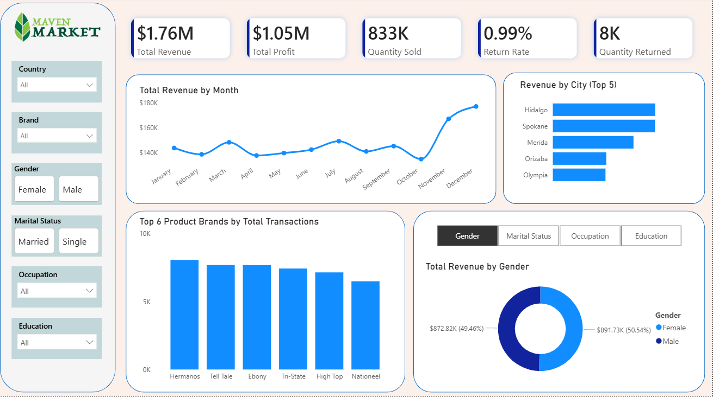
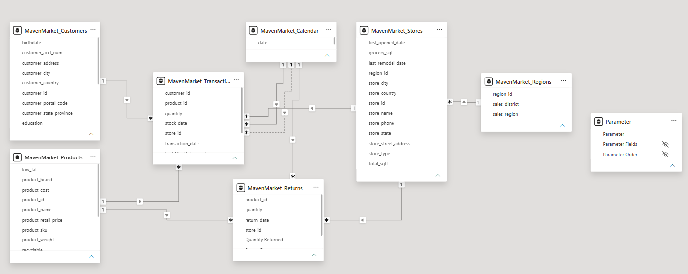
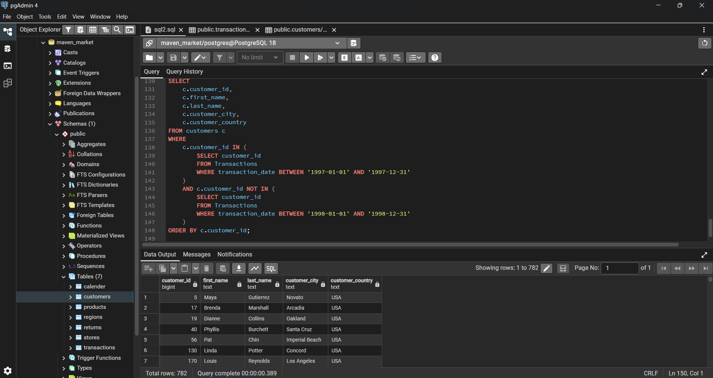

# Maven-Market

## 1. Project Title / Headline
An end-to-end retail intelligence project for Maven Market, a global grocery chain. This project leverages relational database modeling and advanced SQL to optimize inventory, improve customer segmentation, and track regional profitability.

## 2. Short Description / Purpose
The Maven Market Analysis project transforms raw transactional data into actionable business insights. By integrating sales, customer, and return data, this dashboard helps stakeholders identify high-value customer segments, calculate product-level return rates, and evaluate store performance across international regions.

## 3. Tech Stack
This project leverages the following technologies:
- **Power BI Desktop** - Interactive dashboarding and time-intelligence reporting
- **DAX (Data Analysis Expressions)** - Development of business logic for measures such as Total Revenue, Total Profit, Quantities Sold, Return Rate and Quantities returned	
- **Data Modeling** - Implementation of a complex Star Schema with bridges between Fact and Dimension tables.
- **Power Query** - Data transformation and ETL processes
- **PostgreSQL**  - Data cleansing, complex multi-table joins, window functions for ranking, and performance metrics calculation.
- **File Types** – `.pbix`, `.sql`,`.csv`

## 4. Data Source
**Source**: Maven Analytics (Maven Market)
**Location**: South America (USA, Canada, Mexico)
**Key Fields**: 
- transactions and returns: Fact tables capturing operational data.
- customers: Demographic data (Income, Education, Occupation).
- products: Hierarchical data (Brands, Pricing, Fat content).
- stores and regions: Geographic and structural store details.
- calender: A specialized time-table used for solving business questions

## 5. Features / Highlights
### • Business Problem
Maven Market needed to bridge the gap between transactional records and strategic decision-making. Key pain points included identifying "lost" customers (1997 vs 1998) and understanding the impact of returns on net profitability.

### • Goal of the Dashboard
to provide a "Single Source of Truth" for retail operations and management. It aims to:
- Monitor Profitability: Move beyond just "Revenue" to understand "Net Profit" by accounting for product costs.
- Optimize Inventory & Logistics: Use return rate analysis to identify poor-quality products and manage stock levels efficiently.
- Segment Customer Behavior: Translate demographic data (income, occupation, education) into actionable marketing insights.
- Evaluate Regional Efficiency: Benchmark store performance by district and region to identify under-performing areas and successful retail models.
  
### • Key Analytics and Metrics
**Business KPIs**
- Total Revenue: Total Revenue generated
- Net Profit: Total profit earned after covering product cost
- Quantity Sold - Total quantites sold for a perticular product
- Total Returns: Products which where returned 
- Return Rate - The rate of product returning  

**Customer Insights**
- Total Unique Customers: Count of distinct customer IDs.
- Revenue per Customer: Average spend per customer across the dataset.
- Customer Segmentation: Analysis based on Yearly Income (e.g., Entry vs. Executive) and Member Card status (Bronze, Normal, Golden).
- Churn/Retention: Tracking customer activity between years (e.g., the 1997 vs. 1998 cohort analysis you performed in SQL).

**Product & Brand Performance**
- Hero Products/Brands: Top 5 brands generating the highest profit.
- Low-Fat & Recyclable Performance: Analysis of product attributes to see if health/eco-conscious products drive higher revenue.
- Return-Heavy Products: Products with a return rate above the company average (identifying inventory/quality issues).

### Business Impact & Insights
- Customer Retention: Identified a cohort of 1997 shoppers who did not return in 1998, enabling targeted re-engagement marketing.
- Inventory Quality Control: Pinpointed items with disproportionate return rates, providing data for supply-chain review.
- Pricing Strategy: Enabled a clear view of brand-level profitability, allowing management to prioritize high-margin products.
- Regional Growth: Provided a granular view of performance across the USA, Canada, and Mexico, supporting better-informed regional expansion.

## 6. SQL Logic & Insights

Checking for Duplicate Values
```sql
select o.order_id,l.state,l.city,l.location,d.order_date,r.restaurant_name,di.category,di.dish_name,o.price,o.rating,o.rating_count,count(*) as occurance
from fact_orders o
join dim_location l on o.location_id = l.location_id
join dim_date d on o.date_id = d.date_id
join dim_dish di on o.food_id = di.dish_id
join dim_restaurant r on o.restaurant_id = r.restaurant_id
group by o.order_id,l.state,l.city,l.location,d.order_date,r.restaurant_name,di.category,di.dish_name,o.price,o.rating,o.rating_count
having count(*) > 1;
```
Overall Table
```sql
select o.order_id,l.state,l.city,l.location,d.order_date,r.restaurant_name,di.category,di.dish_name,o.price,o.rating,o.rating_count
from fact_orders o
join dim_location l on o.location_id = l.location_id
join dim_date d on o.date_id = d.date_id
join dim_dish di on o.food_id = di.dish_id
join dim_restaurant r on o.restaurant_id = r.restaurant_id
```
```sql
SELECT marital_status,count(*) as patients_as_marital_status
FROM [hospital_db].[dbo].[patients]
GROUP BY marital_status;
```
KPI
1. Total Orders
```sql
select count(order_id) as total_orders
from fact_orders;
```

2. Total Revenue (inr millon)
```sql
select concat(round(sum(price)/1000000,2),' INR Million') as total_revenue
from fact_orders;
```

3. Avg Dish Price
```sql
select concat(round(avg(price),2),' INR') as avg_dish_price
from fact_orders;
```

4. Avg Rating
```sql
select round(avg(rating),2) as avg_rating
from fact_orders;
```

Date Based Analysis
1. Monthly Order Trends
```sql
select 
	extract (year from order_date) as year,
	extract (month from order_date) as month,
	to_char(order_date::DATE, 'Month') as month_name,
	count(order_id) as total_orders
from fact_orders f 
join dim_date d on f.date_id = d.date_id
group by year,month,month_name
order by total_orders desc
```

2. Quarterly Order Trends
```sql
select 
	extract (year from order_date) as year,
	extract (quarter from order_date) as quarter,
	count(order_id) as total_orders
from fact_orders f 
join dim_date d on f.date_id = d.date_id
group by year,quarter
order by total_orders desc
```

3. Year Wise Growth
```sql
select 
	extract (year from order_date) as year,
	count(order_id) as total_orders
from fact_orders f 
join dim_date d on f.date_id = d.date_id
group by year
order by total_orders desc
```

4. Day of Week Patterns
```sql
select 
	to_char(order_date, 'FMDay') as days_of_week,
	count(order_id) as total_orders
from fact_orders f 
join dim_date d on f.date_id = d.date_id
group by days_of_week
order by total_orders desc
```

Location Based Analysis
1. Top 10 Cities by Order Volume
```sql
select 
	city,
	count(order_id) as total_volume
from fact_orders f
join dim_location l on f.location_id = l.location_id
group by city
order by total_volume desc
limit 10;
```

2. Revenue Contribution by States
```sql
select 
	state,
	sum(price) as revenue_by_state
from fact_orders f
join dim_location l on f.location_id = l.location_id
group by state
order by revenue_by_state desc;
```

Food Performance
1. Top 10 Resturants by Orders
```sql
select 
	restaurant_name,
	count(order_id) as total_orders
from fact_orders f
join dim_restaurant r on f.restaurant_id = r.restaurant_id
group by restaurant_name
order by total_orders desc
limit 10;
```

2. Top Categories
```sql
select 
	category,
	count(order_id) as total_orders
from fact_orders f
join dim_dish di on f.food_id = di.dish_id
group by category
order by total_orders desc
limit 10;
```

3. Most Ordered Dishes
```sql
select 
	dish_name,
	count(order_id) as total_orders
from fact_orders f
join dim_dish di on f.food_id = di.dish_id
group by dish_name
order by total_orders desc
limit 10;
```

4. Cuisine Performance
```sql
select 
	category,
	count(order_id) as total_orders,
	round(avg(rating),2) as avg_rating
from fact_orders f
join dim_dish di on f.food_id = di.dish_id
group by category
order by total_orders desc;
```

5. Total Orders by Price Range
```sql
select
	case
		when price < 100 then 'Under 100'
		when price between 100 and 199 then '100 - 199'
		when price between 200 and 299 then '200 - 299'
		when price between 300 and 399 then '300 - 399'
		when price between 400 and 499 then '400 - 499'
		else 'Over 500'
	end as price_range,
	count(order_id) as total_orders
from fact_orders
group by price_range
order by total_orders desc;
```

6. Rating Count Distribution
```sql
select
	case
		when price < 100 then 'Under 100'
		when price between 100 and 199 then '100 - 199'
		when price between 200 and 299 then '200 - 299'
		when price between 300 and 399 then '300 - 399'
		when price between 400 and 499 then '400 - 499'
		else 'Over 500'
	end as price_range,
	count(order_id) as total_orders
from fact_orders
group by price_range
order by total_orders desc;
```

## 7. Screenshots / Demos



    

