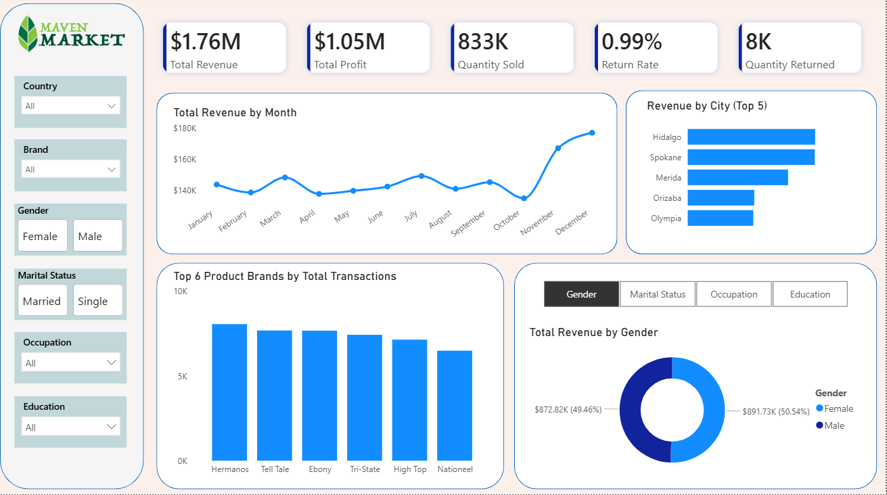
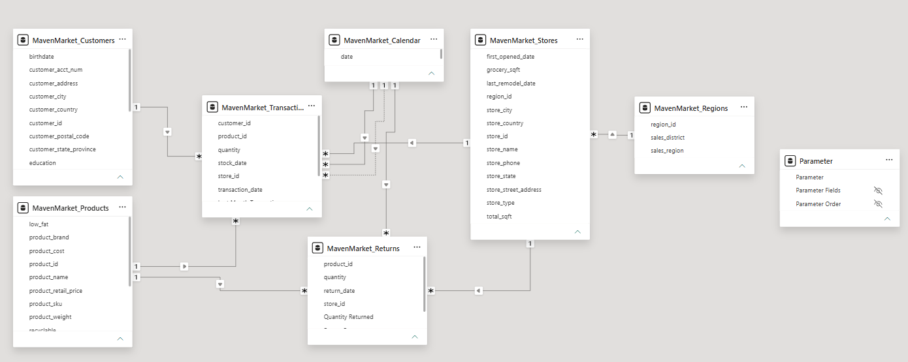
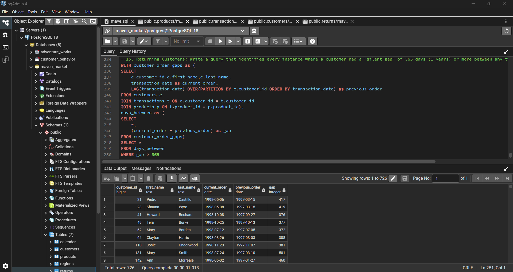

# Maven-Market

## 1. Project Title / Headline
An end-to-end retail intelligence project for Maven Market, a global grocery chain. This project leverages relational database modeling and advanced SQL to optimize inventory, improve customer segmentation, and track regional profitability.

## 2. Short Description / Purpose
The Maven Market Analysis project transforms raw transactional data into actionable business insights. By integrating sales, customer, and return data, this dashboard helps stakeholders identify high-value customer segments, calculate product-level return rates, and evaluate store performance across international regions.

## 3. Tech Stack
This project leverages the following technologies:
- **Power BI Desktop** - Interactive dashboarding and time-intelligence reporting
- **DAX (Data Analysis Expressions)** - Development of business logic for measures such as Total Revenue, Total Profit, Quantities Sold, Return Rate and Quantities returned	
- **Data Modeling** - Implementation of a complex Star Schema with bridges between Fact and Dimension tables.
- **Power Query** - Data transformation and ETL processes
- **PostgreSQL**  - Data cleansing, complex multi-table joins, window functions for ranking, and performance metrics calculation.
- **File Types** – `.pbix`, `.sql`,`.csv`

## 4. Data Source
**Source**: Maven Analytics (Maven Market)
**Location**: South America (USA, Canada, Mexico)
**Key Fields**: 
- transactions and returns: Fact tables capturing operational data.
- customers: Demographic data (Income, Education, Occupation).
- products: Hierarchical data (Brands, Pricing, Fat content).
- stores and regions: Geographic and structural store details.
- calender: A specialized time-table used for solving business questions

## 5. Features / Highlights
### • Business Problem
Maven Market needed to bridge the gap between transactional records and strategic decision-making. Key pain points included identifying "lost" customers (1997 vs 1998) and understanding the impact of returns on net profitability.

### • Goal of the Dashboard
to provide a "Single Source of Truth" for retail operations and management. It aims to:
- Monitor Profitability: Move beyond just "Revenue" to understand "Net Profit" by accounting for product costs.
- Optimize Inventory & Logistics: Use return rate analysis to identify poor-quality products and manage stock levels efficiently.
- Segment Customer Behavior: Translate demographic data (income, occupation, education) into actionable marketing insights.
- Evaluate Regional Efficiency: Benchmark store performance by district and region to identify under-performing areas and successful retail models.
  
### • Key Analytics and Metrics
**Business KPIs**
- Total Revenue: Total Revenue generated
- Net Profit: Total profit earned after covering product cost
- Quantity Sold - Total quantites sold for a perticular product
- Total Returns: Products which where returned 
- Return Rate - The rate of product returning  

**Customer Insights**
- Total Unique Customers: Count of distinct customer IDs.
- Revenue per Customer: Average spend per customer across the dataset.
- Customer Segmentation: Analysis based on Yearly Income (e.g., Entry vs. Executive) and Member Card status (Bronze, Normal, Golden).
- Churn/Retention: Tracking customer activity between years (e.g., the 1997 vs. 1998 cohort analysis you performed in SQL).

**Product & Brand Performance**
- Hero Products/Brands: Top 5 brands generating the highest profit.
- Low-Fat & Recyclable Performance: Analysis of product attributes to see if health/eco-conscious products drive higher revenue.
- Return-Heavy Products: Products with a return rate above the company average (identifying inventory/quality issues).

### Business Impact & Insights
- Customer Retention: Identified a cohort of 1997 shoppers who did not return in 1998, enabling targeted re-engagement marketing.
- Inventory Quality Control: Pinpointed items with disproportionate return rates, providing data for supply-chain review.
- Pricing Strategy: Enabled a clear view of brand-level profitability, allowing management to prioritize high-margin products.
- Regional Growth: Provided a granular view of performance across the USA, Canada, and Mexico, supporting better-informed regional expansion.

## 6. SQL Logic & Insights

1. Total Revenue Check: Calculate the total revenue generated in millions for the entire dataset with the currency.
```sql
SELECT 
	concat('$',round(SUM(p.product_retail_price * t.quantity)/1000000,2),'M') as total_revenue
FROM transactions t
JOIN products p ON t.product_id = p.product_id;
```

2. Multi-Dimensional Customer Segmentation Analysis: Write a series of queries that aggregate total revenue across Country, Gender, Marital Status, Occupation, and Education Level.
```sql
SELECT 
	customer_country,
	ROUND(SUM(t.quantity * p.product_retail_price),2) as revenue
FROM customers c
JOIN transactions t ON c.customer_id = t.customer_id
JOIN products p ON t.product_id = p.product_id
GROUP BY customer_country
ORDER BY revenue DESC;
```

```sql
SELECT 
	gender,
	ROUND(SUM(t.quantity * p.product_retail_price),2) as revenue
FROM customers c
JOIN transactions t ON c.customer_id = t.customer_id
JOIN products p ON t.product_id = p.product_id
GROUP BY gender
ORDER BY revenue DESC;
```

```sql
SELECT 
	marital_status,
	ROUND(SUM(t.quantity * p.product_retail_price),2) as revenue
FROM customers c
JOIN transactions t ON c.customer_id = t.customer_id
JOIN products p ON t.product_id = p.product_id
GROUP BY marital_status
ORDER BY revenue DESC;
```

```sql
SELECT 
	occupation,
	ROUND(SUM(t.quantity * p.product_retail_price),2) as revenue
FROM customers c
JOIN transactions t ON c.customer_id = t.customer_id
JOIN products p ON t.product_id = p.product_id
GROUP BY occupation
ORDER BY revenue DESC;
```

```sql
SELECT 
	education,
	ROUND(SUM(t.quantity * p.product_retail_price),2) as revenue
FROM customers c
JOIN transactions t ON c.customer_id = t.customer_id
JOIN products p ON t.product_id = p.product_id
GROUP BY education
ORDER BY revenue DESC;
```

3. Monthly Revenue Trends: List the total revenue for each month
```sql
SELECT 
	extract(month from c.date) as month,
	to_char(date::DATE,'Month') as month_name,
	ROUND(SUM(t.quantity * p.product_retail_price),2) as revenue
FROM transactions t
JOIN calender c on t.transaction_date = c.date
JOIN products p on t.product_id = p.product_id
GROUP BY month,month_name
ORDER by month;
```

4. Top 10 Popular Products: Which 10 products are the most revenue generating.
```sql
SELECT 
	product_name,
	ROUND(SUM(t.quantity * p.product_retail_price),2) as revenue
FROM transactions t
JOIN products p ON t.product_id = p.product_id
GROUP BY product_name
ORDER BY revenue DESC
LIMIT 10;
```

5. Top 6 Brands: Which brand has the highest number of total orders?
```sql
SELECT 
	product_brand,
	count(t.product_id) as total_transactions
FROM customers c
JOIN transactions t ON c.customer_id = t.customer_id
JOIN products p ON t.product_id = p.product_id
GROUP BY product_brand
ORDER BY total_transactions DESC
LIMIT 6;
```

6. Customer Loyalty (Churn): Identify "Inactive Customers"—those who haven't placed an order.
```sql
SELECT 
	concat(first_name,' ',last_name) as full_name
FROM customers c
LEFT JOIN transactions t ON c.customer_id = t.customer_id
WHERE t.customer_id is NULL
ORDER BY full_name;
```
```sql
SELECT 
	concat(first_name,' ',last_name) as full_name 
FROM customers
WHERE customer_id not in (select distinct customer_id FROM transactions)
ORDER BY full_name;
```

7. Unsold Inventory: Identify all products that have never been sold.
```sql
SELECT 
	product_name
FROM products p
LEFT JOIN transactions t ON p.product_id = t.product_id
WHERE t.product_id is NULL;
```
```sql
SELECT
	product_name 
FROM products
WHERE product_id not in (select distinct product_id FROM transactions);
```

8. High-Value Customers: Find the top 10 customers by total spend. Show their full name,total orders placed and revenue.
```sql
SELECT 
	concat(first_name,' ',last_name) as full_name,
	count(t.product_id) as total_orders,
	ROUND(SUM(t.quantity * p.product_retail_price),2) as revenue
FROM customers c
JOIN transactions t ON c.customer_id = t.customer_id
JOIN products p ON t.product_id = p.product_id
GROUP BY full_name
ORDER BY revenue DESC
```

9. Count the total number of returns for each product_id, but only include products that have been returned more than 5 times.
```sql
SELECT
	r.product_id, p.product_name,
	count(*) as times_returned
FROM returns r
JOIN products p on r.product_id = p.product_id
GROUP BY r.product_id, p.product_name
HAVING count(*) > 5
ORDER BY times_returned DESC
```

10. Weekend vs. Weekday: Analyze total revenue broken down by the Day of the Week.
```sql
SELECT 
	extract(dow from c.date) as day_number,
	to_char(date::DATE,'FMDay') as day_name,
	ROUND(SUM(t.quantity * p.product_retail_price),2) as revenue
FROM transactions t
JOIN calender c on t.transaction_date = c.date
JOIN products p on t.product_id = p.product_id
GROUP BY day_number,day_name
ORDER by day_number,day_name
```

11. Income Bracket Performance: Fragment customers into 'Low' (<$500), 'Medium' ($500-$1500), and 'High' (>$1500) income brackets and find the total revenue generated by each bracket.
```sql
WITH customer_revenue as (
SELECT
	c.customer_id,c.first_name,c.last_name,
	ROUND(SUM(t.quantity * p.product_retail_price),2) as revenue
FROM customers c
JOIN transactions t ON c.customer_id = t.customer_id
JOIN products p ON t.product_id = p.product_id
GROUP BY c.customer_id,c.first_name,c.last_name
),
revenue_segmentation as (
SELECT *,
	CASE 
		WHEN revenue > 1500 THEN 'High'
		WHEN revenue BETWEEN 500 AND 1500 THEN 'Medium'
		ELSE 'Low'
	END AS revenue_tier
FROM customer_revenue
)
SELECT 
	revenue_tier,
	SUM(revenue) as revenue
FROM revenue_segmentation
GROUP BY revenue_tier
ORDER BY 
	CASE revenue_tier
		WHEN 'Low' THEN 1
		WHEN 'Medium' THEN 2 
		ELSE 3
	END;
```

12. . Month-over-Month Growth: Calculate the monthly revenue and the percentage change compared to the previous month.
```sql
WITH monthly_sales as(
SELECT 
	TO_CHAR(c.date,'YYYY-MM') as month,
	ROUND(SUM(t.quantity * p.product_retail_price),2) as revenue
FROM transactions t
JOIN calender c on t.transaction_date = c.date
JOIN products p on t.product_id = p.product_id
GROUP BY month),
monthly_revenue_comparision as (
SELECT
	month,
	revenue as current_month_revenue,
	lag(revenue) over(order by month) as previous_month_revenue
FROM monthly_sales
)
SELECT 
	*,
	CONCAT(ROUND(100 * ((current_month_revenue - previous_month_revenue) / previous_month_revenue),2),'%') as mom_growth_pct
FROM monthly_revenue_comparision;
```

13. Top 3 Customers per Occupation: Find the top 3 spending customers within each occupation category.
```sql
WITH customer_spending as (
SELECT 
	c.customer_id,c.first_name,c.last_name,c.occupation,
	ROUND(SUM(t.quantity * p.product_retail_price),2) as revenue
FROM customers c
JOIN transactions t ON c.customer_id = t.customer_id
JOIN products p ON t.product_id = p.product_id
GROUP BY c.customer_id,c.first_name,c.last_name,c.occupation
),
ranked_customers as (
SELECT 
	*,
	DENSE_RANK() OVER(PARTITION BY occupation ORDER BY revenue DESC) as rnk
FROM customer_spending)
SELECT * 
FROM ranked_customers
WHERE rnk <= 3
```

14. Rolling 7-Day Revenue: Calculate a 7-day rolling average of revenue.
```sql
WITH daily_revenue as (
SELECT 
	c.date as date,
	ROUND(SUM(t.quantity * p.product_retail_price),2) as revenue
FROM transactions t
JOIN calender c on t.transaction_date = c.date
JOIN products p on t.product_id = p.product_id
GROUP BY date)
SELECT 
	*,
	ROUND(AVG(revenue) OVER(ORDER BY date ROWS BETWEEN 6 PRECEDING AND CURRENT ROW),2) as moving_avg_7_day
FROM daily_revenue;
```

15. Returning Customers: Write a query that identifies every instance where a customer had a "silent gap" of 365 days (1 year) or more between any two consecutive orders.
```sql
WITH customer_order_gaps as (
SELECT 
	c.customer_id,c.first_name,c.last_name,
	transaction_date as current_order,
	LAG(transaction_date) OVER(PARTITION BY c.customer_id ORDER BY transaction_date) as previous_order
FROM customers c
JOIN transactions t ON c.customer_id = t.customer_id
JOIN products p ON t.product_id = p.product_id),
days_between as (
SELECT 
	*,
	(current_order - previous_order) as gap
FROM customer_order_gaps)
SELECT *
FROM days_between
WHERE gap > 365
```

## 7. Screenshots / Demos



